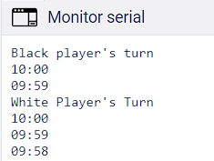
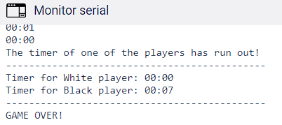

# Chess-Clock-with-External-and-Timer-Interrupts

This is a project to build a chess clock on Tinkercad using a single Arduino Uno and external and timer interrupts, carried out in the Computer Architecture course of 2022/02.

## What is a chess clock?

According to FIDE (International Chess Federation), a "chess clock" is a "clock" with two time displays, connected to each other in such a way that only one of them can function at a time. In turn, "clock" means one of the two time displays. We can then define a chess clock as two timers, one for the white player and one for the black player, which work alternately, occurring the change by pressing a button "belonging" to that player. That is, the button of the white player pauses his timer and activates the timer of the black player. The button of the black player pauses his timer and activates the timer of the white player. 

## Project Objective:

The clock must have two buttons for the players (white and black) and two LEDs indicating the turn of each player. The remaining time of each player must be displayed on the screen in a countdown format, mm:ss. The project should start with both timers at 10 minutes, paused until one of the players presses the button, starting the opponent's timer. The buttons should activate the modifiers through external interrupts and the code should not use functions that force the Arduino clock or loop.

## Project Simulation

The project can be simulated through the following link: [chess clock simulation](https://www.tinkercad.com/things/2Bn6gbBS8Te?sharecode=OD2wdH76RxLJTiaoDTrKe_Ps7N-FKLQ1d4wBu69mYkY).

## Schematic View of the Circuits

   

## Required Components

| COMPONENT| QUANTITY |
| ------ | ------ |
| Arduino Uno R3  | 1 |
| Protoboard | 1 |
| Button  | 2 |
| Led | 2| 
| 1 kΩ Resistor | 2 |

## Example of the Running Application

To start, the player (White or Black) must press the button. Upon pressing, the time of their opponent will begin to decrement until they move one of their pieces and press their button, passing the turn to the next player.

The timer is set for 10 minutes. If one of the players runs out of time, the execution will be ended, showing the remaining time of each player. Whoever runs out of time loses the game!

   
   

